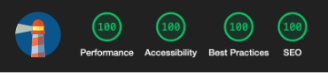

## Pixel on Pixel
Most of my work is on private client repos. I've made this repo for  [Pixel on Pixel](https://pixelonpixel.com/) publicly visible as a sample of my work.

**Status:** Ongoing development\
**Stack:** Nextjs, Typescript, Tailwind 

\
__ * Lighthouse test done in browser tools on live url. Score for both mobile and desktop. Score may vary slightly bewtween tests.__

---
#### Scripts
--- 
```
build: "next build",
dev: "next dev",
lint: "next lint",
start: "next start"
```

## Roadmap
**Notes:** There's some Typescript erros to be cleaned up a few other notes listed in Todo Tree using these tags: BUG, HACK, NOTE, QUESTION and TODO


---
#### Stage 1
---
- [x] STAGE 0: Initial Commit
- [x] - add old placeholder
- [x] - add Tailwind
- [x] STAGE 1: Deploy Placeholder

---
#### Stage 2
---
- [x] STAGE 2: Tailwind Conversion
- [x] - refactor styles
- [x] - add custom fonts

---
#### Stage 3
---
- [x] STAGE 3: Convert to T3 Stack
- [x] STAGE 4: Core Components
- [x] - video hero
- [x] - about
- [x] - feartured work
- [x] - previous work
- [x] - feeback
- [x] - services
- [x] - contact form
- [x] - cleanup & performance
- [x] - cleanup for public visibility

---
#### Stage 4
---
- [ ] STAGE 5: Flair 
- [ ] - animation state 
- [ ] - transitions and effects
- [ ] - colour 

---
#### Future Tasks
---
- [ ] STAGE X: Storybook Presentation
- [ ] STAGE X: Sanity CMS
- [ ] STAGE X: Additional Pages